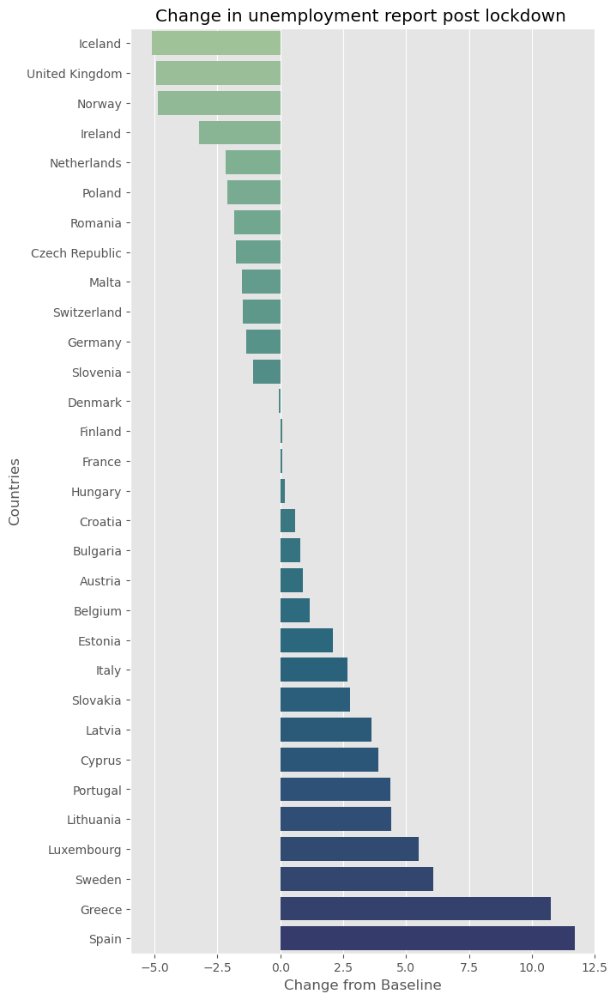

Maslow's Hierarchy of Needs serves as a model for assessing human behavior, offering insights into the profound shifts witnessed during the pandemic. From altered relationship dynamics to revised safety measures and changing professional priorities, our needs underwent a transformative evolution.

The pivotal consideration lies in whether the data collected during this critical period truly encapsulates our emotions and intuitions. Is it aligned with Maslow's enduring theory, a testament to its continued dominance in shaping our daily lives? This study delves into the pandemic-induced changes, exploring whether Maslow's framework remains a relevant and accurate tool for understanding these shifts.

Our research only encompasses EU countries. By examining the intricacies of the data at hand, we aim to uncover the resonance between our evolving needs and the timeless principles outlined by Maslow's Hierarchy, providing a nuanced perspective on the enduring impact of his theory.
The ultimate goal is to redefine this sacred hierarchy in order for it to resonate with the reality that was the life during the pandemic

This behavioral study bases itself on web-browsing data such as Wikipedia page views and Google trends, transportation and mobility data provided by Google and Apple, and EU-centric unemployment data.

# **Methods**
## Categorization task
While Mobility and Unemployment Data directly point us to the lower-two levels of the pyramid, Physiological Needs and Safety, exctracting data for the upper three levels is a bit more intricate: Wikipedia pages and topics are not intuitively classified into Esteem, Love and Affection and Self-Actualization, this needed to be done in order to complete the study.

## Difference in Differences
A world plunged into the unforeseen chaos of the COVID-19 pandemic in early 2020. No corner untouched, no exception granted. Now, in our quest to unravel the pandemic's impact, we find ourselves navigating a unique methodology—the difference in differences (or DiD).

DiD analysis is used to underline the effect of a certain treatment affecting a group (or population). In our study, the treatment is the Covid-19 virus. A DiD analysis is relevant to us as it can explain the effect of Covid-19 on different types of data whilst removing the influence of other underlying factors that are unexplained in our data sets such as seasonal fluctuations or normal growth in data numbers, using what is called a control group. In an ideal case DiD is performed using two groups, one of which receives a treatment and the other doesn't, obviously this is not possible in our case as the pandemic hit the globe at roughly the same time period without exempting a group of people. Since this is an observational analysis, we found a way to compare two similar groups, using previous data over the same populations, ideally in the same period as covid in the beginning of 2019. The results of DiD is a coefficient (from regression) that gives us the effect the treatment (pandemic) had over our data, and therefore when looking at categories of Maslow's pyramid this can highlight which needs saw an increased interest compared to others, helping us redefine the pyramid.

# The secrets at the base of the Pyramid
## Navigating Necessities: The Unwavering Pursuit of Physiological Needs During the Pandemic
Our assessment of Physiological Needs drew primarily from the Global Mobility Report and Google Trends. These needs encompass essentials like food, water, and fundamental health requirements, such as medicine, supplements, or vitamins. Typically, these items are procured from grocery stores or pharmacies. Given that these establishments were considered essential businesses during the pandemic, people continued to have access to them. To gauge the shift in physiological needs during the challenging times of the pandemic, we will examine how the frequency of visits to these critical businesses changed, as indicated by mobility data. Additionally, we'll look at Google Trends data for 'Grocery Store' and 'Pharmacy' searches to corroborate or challenge our initial findings.

As the world slowed down during the pandemic, grocery stores and pharmacies became lifelines in the quiet streets. They remained busy and essential, a constant in people’s lives when so much else had changed. Every visit to these stores was a small yet significant step, a reminder that some things, like our basic needs, stay steady even in uncertain times.

Observing either a positive or no significant difference overall, it is reasonable to conclude that the fulfillment of physiological needs, as represented by grocery stores and pharmacies, maintained or increased their importance during the COVID-19 period. 

Online searches mirrored this trend, with keystrokes lighting up the internet in search of nourishment and wellness. The data painted a clear picture: as the world paused, the heartbeat of our basic needs throbbed ever stronger, revealing through the numbers a narrative of resilience. 

The bar chart indicates that based on Google Trends data, there was generally a smaller reduction—or in some cases, an increase—in the public's interest in grocery stores and pharmacies compared to shopping malls during the pandemic. This suggests that essential needs, such as those for food and healthcare, maintained a consistent level of importance as reflected by online search behaviors.

Averaging all the coefficients together, we can determine how much more dominant physiological needs were during the pandemic.The bar plot below displays the overall fluctuation in grocery shopping, pharmacy and overall physiological needs.

<iframe src="assets/physio_did.html" width="100%" height="400" scrolling="yes" frameborder="0"></iframe>

## Job Security in Crisis: The Pandemic's Impact on Maslow's Safety Layer
EU Unemployment Data revealed a few things about how financial safety's place evolved during the pandemic. Preliminary studies on the overall number of inactive people show how the inactive European population was distributed amongst different groups: the number of inactive men  grew after the lockdown with respect to women, as did the number of unemployed 'young' people (under 25) with respect to 'older ' people (between the ages of 25 and 74). The pie charts help us visualize the results: labels Y_LT25 and Y25-74 respectively represent the younger and older population, as for the M and F labels, they represent male and female individuals. 
 
#### Distribution of Unemployed Individuals per Group

Given these results, the next natural step is to generalize to an EU-wide scale, to understand how relevant safety needs related to employment were during covid times, and the answers lie in the time-series of unemployment rates across EU countries. Naively, plotting, regressing over the data and extracting coefficients should provide the key elements to infer the evolution of safety needs.  For the remainder of this analysis, march 2020 is considered as the lockdown starting point. Identifying data as pre and post-lockdown allows us to conduct the study on unemployment data.

#### Time-Series of Unemployment Rates per European Country

Using least squares over this data to estimate the coefficients of unemployment rate change that the lockdown-country interaction brings yields the following results:

This analysis shows that some countries, like Iceland, had a thriving employment situation during lockdown whilst other countries, such as Spain, were struggling with employment levels.
However, it has one main fallacy: it does not consider seasonality. A fallacy that **Difference in Differences** solves.
Using the aforementioned method, the following coefficients are obtained:
<iframe src="assets/unemployment_did.html" width="100%" height="750" scrolling="yes" frameborder="0"></iframe>

Contrary to the first, naive analysis, the DiD method proves that unemployment rates have skyrocketed during times of COVID, with a few exceptions. The E

## Ascending Maslow's Summit: A Deep Dive into the Upper Tiers During COVID-19

When it comes to the top three levels of Maslow's Hierarchy, the analysis will be based on wikipedia pageviews, collected on a monthly basis between 2019-01 and 2020-08 : a period that allows us to capture the impact of different Covid-19 measures, such as lockdowns. Once we are done with the introductory analysis for each level, we will go into a differences in differences analysis (DiD) to conclude and summarize our results for the top three levels.

### The Pulse of Connection: Tracking Love and Belonging in a Pandemic World

In the plot above, we see the evolution, on average, of the relative percentage change from the baseline of multiple topics related to Love & Belonging, for six different countries within europe. This allows us to evaluate how the general interest in Love & Belonging topics has evolved during this period.

We can see that they're seems to be a shift upwards in the interest of these topics straight after the first Covid-19 death and the date on which the first lockdown measures were implemented. Which would seem to suggest that the interest in Love & Belonging Topics has increased during Cocid-19 in Europe.

In the graph above, this shift upwards is a lot more evident. In order to have a more conclusive analysis, we will be employing a differences in differences approach.

### Esteem in the Age of Isolation

The same principle is used for Esteem Topics : 

Again, looking at the above plots, we see that this trend upwards, straight after the first Covid death and the first lockdown, is very evident, especially in the second graph when we average out the data together. 

### The Drive for Self-Actualization: A Pandemic-Era Transformation

Finally, we will look at the data representing Self-Actualization :

We obtain the same general results : a general shift upwards after the first Covid death and the first lockdown. We will now move onto to DiD analysis in order to get more conclusive results.

### Results

The global pandemic left its mark on Maslow's pyramid, particularly on its top three categories. To understand the extent of this impact, we turn to our reliable DiD tool for quantification. It enables us to understand exactly how strongly these categories were impacted, and which ones were most attractive for people.

Examining the data, a notable trend surfaces. Despite the challenges, the pandemic had a positive effect on pageviews in all three top categories of Maslow's pyramid. Notably, Self-Actualization experienced the most significant increase.

In conclusion, the upper levels of Maslow's pyramid remained robust throughout the Covid-19 period, showing resilience in the face of adversity, or rather the void created by the pandemic led to people having a stronger interest in subjects of deeper meaning, like their personal growth, life goals and their value to others. 

## Test Plots using plotly & Progress bars

<iframe src="countries.html" width="100%" height="750" scrolling="no" frameborder="0"></iframe>

# Revealed
Summin the different Differences in Differences coefficients and sorting them in ascending order yields the following barplot. These coefficients are comparable for the following reasons:
- Same metric across all data (percentages)
- Similar treatment, in this case lockdown
- Same treatment and control testing periods

  

<iframe src="assets/final_did.html" width="100%" height="400" scrolling="yes" frameborder="0"></iframe>

The following video illustrates the shift the pyramid levels endured during the pandemic:

<iframe 
    width="560" 
    height="315" 
    src="https://www.youtube.com/embed/tFMfmEIIHtE?si=gSMYTtHGwF6r4DX2" 
    title="YouTube video player" 
    frameborder="0" 
    allow="accelerometer; autoplay; clipboard-write; encrypted-media; gyroscope; picture-in-picture; web-share" 
    allowfullscreen
    style="display: block; margin: auto;">
</iframe>

## Conclusion

The emergence of the COVID-19 pandemic has prompted a reevaluation of Maslow’s "Hierarchy of Needs" theory under conditions of crisis. It remains evident that the theory's foundational concepts still hold; however, the pandemic has instigated a notable reorganization in how needs are approached and addressed. The traditionally solid base of Maslow’s pyramid, the Physiological Needs, saw a dynamic shift as people globally adjusted their priorities to navigate the new landscape of the pandemic.

Self-Actualization, typically the pinnacle of Maslow's structure, took on a more central role. The data analyzed suggests a collective reemphasis on self-improvement and personal development, likely a countermeasure to the confinements of lockdowns and the resultant introspection. The disruption brought on by the pandemic may have catalyzed a transformative perspective, positioning the quest for self-fulfillment as a more immediate concern, with individuals actively reshaping their aspirations to find satisfaction and purpose in the midst of adversity.

The pandemic's impact was also acutely felt in the realm of social interactions and the essential need for love and belonging. With the implementation of social distancing, traditional forms of interaction were supplanted by digital communication, indicating a versatile approach to sustaining social bonds.

Summing up, the global health crisis has emphasized the adaptability of Maslow's hierarchy, revealing a flexible sequence of needs responsive to external shocks. While the base needs of Physiological and Safety remained essential, their urgency and presence in the hierarchy were subject to change. Esteem and Love and Belonging needs, though critical, were redefined as people sought alternative methods of fulfillment. The pandemic has highlighted humanity's inherent ability to recalibrate its motivational mechanisms, demonstrating an impressive capacity for innovation in meeting its varied needs amidst a landscape of global upheaval.
